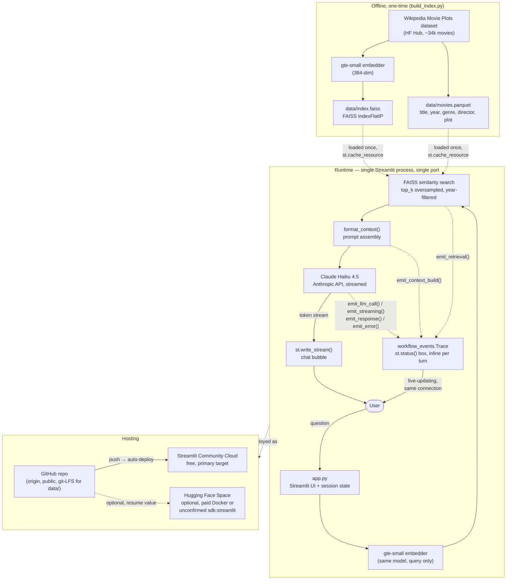
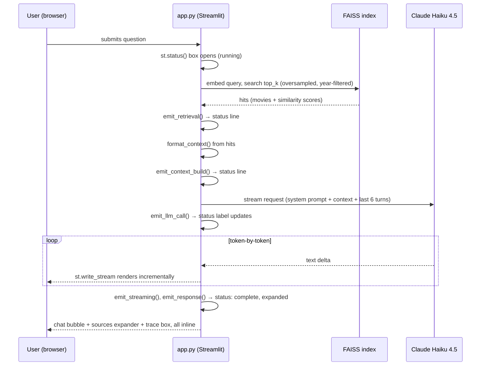

# Architecture

## System overview

## Components

| Component | Role | Notes |
|---|---|---|
| `build_index.py` | Offline embedding + index build | Runs once (~15 min CPU); output committed via git LFS |
| `app.py` | The entire runtime app | UI, retrieval, prompt assembly, generation, all in one Streamlit script |
| `workflow_events.py` | System Design Panel | Thin wrapper over `st.status()` — no server, no queue |
| `data/index.faiss`, `data/movies.parquet` | Prebuilt retrieval corpus | Loaded once per process via `@st.cache_resource`, never rebuilt at runtime |
| Anthropic API (Claude Haiku 4.5) | Generation | Streamed via `client.messages.stream(...)`; only external network dependency at runtime |

## Why a single process, single port

The whole app — UI rendering, retrieval, prompt building, the Claude call,
and the live "System Design Panel" trace — runs inside **one Streamlit
script, over one WebSocket connection, on one port.** This wasn't the
original design (an earlier version ran a second stdlib HTTP server on a
second port purely to feed the trace panel via Server-Sent Events — see
`CHALLENGES.md` §1), but collapsing it to a single process turned out to be
both simpler *and* a hosting requirement: every free hosting platform
evaluated for this project (Hugging Face Spaces, Streamlit Community Cloud,
Render) exposes exactly one port per app. A design that depends on a second
port doesn't just fail on one of them — it fails on all of them.

## Request lifecycle (one question → one answer)

## Cost shape

- **Hosting:** $0 — Streamlit Community Cloud's free tier, or Hugging Face
  Spaces' free CPU Basic tier if the optional HF add-on is used.
- **Retrieval:** $0 at runtime — the embedding model and index are prebuilt
  and loaded once per process; only the user's query is embedded live, and
  that's local CPU inference, not a paid API call.
- **Generation:** the only per-request cost. Pinned to Claude Haiku 4.5
  specifically to minimize this (~$0.005/question at this app's typical
  context size) — see `CHALLENGES.md` §5 for the model-selection reasoning
  and `DEPLOY.md` for spend-limit setup via a dedicated Anthropic workspace.
